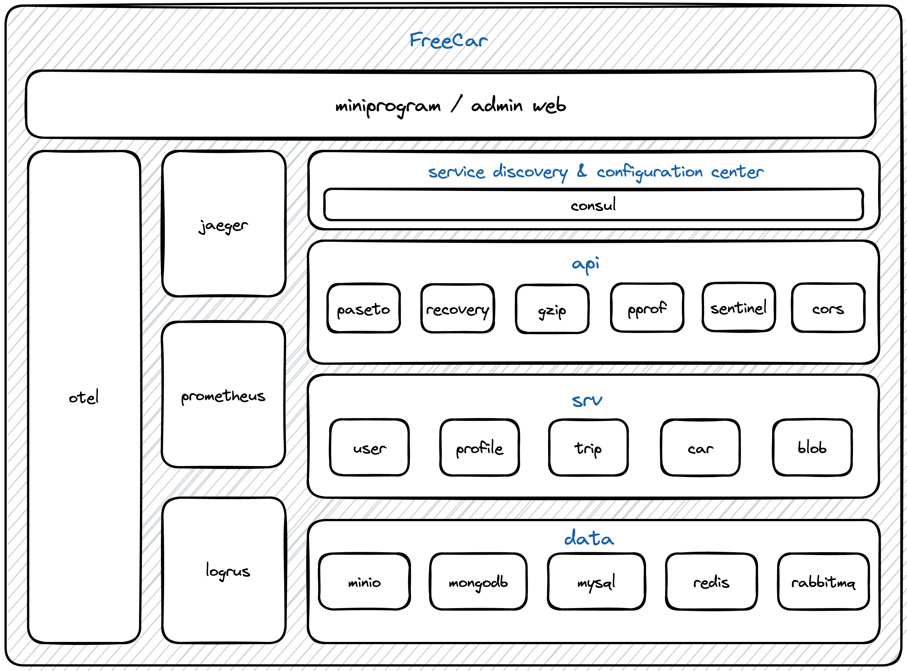
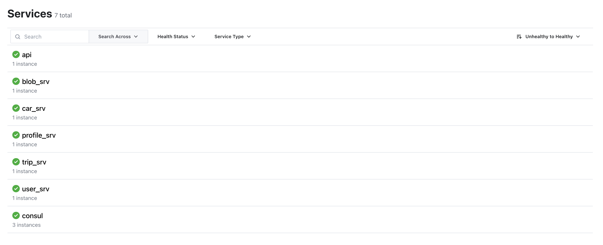

[English](README.md) | 中文

FreeCar 是一个基于 [Hertz](https://github.com/cloudwego/hertz) 与 [Kitex](https://github.com/cloudwego/kitex) 的云原生分时汽车租赁系统套件。

## 项目架构

### 调用关系


### 技术架构



### 服务关系


## 技术栈

| 功能        | 实现                  |
|-----------|---------------------|
| HTTP 框架   | Hertz               |
| RPC 框架    | Kitex               |
| 数据库       | MongoDB、MySQL、Redis |
| 身份鉴权      | Paseto              |
| 服务发现与配置中心 | Consul              |
| 消息队列      | RabbitMQ            |
| 服务治理      | OpenTelemetry       |
| 限流熔断      | Sentinel            |
| 对象存储      | Minio               |
| 图像识别      | 百度 OCR              |
| CI        | GitHub Actions      |

## 页面展示

小程序端地址 [FreeCar-MP](https://github.com/CyanAsterisk/FreeCar-MP)

后台管理端地址 TODO


## 目录介绍

| 目录     | 介绍             |
|--------|----------------|
| Cmd    | 项目核心部分         |
| Idl    | 项目所有服务的 IDL 文件 |
| Shared | 可复用代码          |

## 服务介绍

| 目录      | 介绍                   |
|---------|----------------------|
| API     | 基于 Hertz 的网关服务       |
| User    | 用户认证服务               |
| Blob    | 与图片和 Minio 对象存储相关的服务 |
| Car     | 汽车服务                 |
| Profile | 主页与图片识别服务            |
| Trip    | 行程服务                 |

## 快速开始

### 启动基础环境

```shell
make start
```

### 配置 Consul

> 默认 Consul 地址与 KV 配置等请参考各个 `config.yaml` 配置文件。




关于 KV 键值对的详细配置，[详见](docs/CONSUL_CONFIG.md)。

### 启动 HTTP 服务

```shell
make api
```

### 启动 RPC 服务

```shell
make user
make blob
make car
make profile
make trip
```

### Jaeger

> 在浏览器上访问 `http://127.0.0.1:16686/`


### Prometheus

> 在浏览器上访问 `http://127.0.0.1:3000/`


## 开发指南

通过直接阅读源码来了解此项目是非常困难的，在此提供开发指南方便开发者快速了解并上手此项目包括 Kitex、Hertz 等框架。

### 前置准备

通过快速开始中的命令快速启动所需的工具与环境，若需要特殊定制请修改 `docker-compose.yaml` 与 Nacos 配置中的内容。

### IDL

在开发之前我们需要定义好 IDL 文件，其中 hz
为开发者提供了许多定制化的 [api 注解](https://www.cloudwego.io/zh/docs/hertz/tutorials/toolkit/usage/annotation/#%E6%94%AF%E6%8C%81%E7%9A%84-api-%E6%B3%A8%E8%A7%A3)。

示例代码：

```thrift
namespace go user

struct LoginRequest {
    1: string code
}

struct LoginResponse {
    1: i64 accountID
}

service UserService {
    LoginResponse Login(1: LoginRequest req)
}
```

### 代码生成

#### Kitex

首先在 `shared` 文件夹下生成 `kitex_gen`，再在相对应服务文件夹下依赖 `kitex_gen` 进行生成。在新增服务目录下执行，每次仅需更改服务名与 IDL 路径。

```shell
kitex -module github.com/CyanAsterisk/FreeCar ./../idl/rpc/user.thrift
kitex -service user -module github.com/CyanAsterisk/FreeCar -use github.com/CyanAsterisk/FreeCar/server/shared/kitex_gen  ./../../idl/rpc/user.thrift
```

注意项：

- 用 `-module github.com/CyanAsterisk/FreeCar` 该参数用于指定生成代码所属的 Go 模块，避免路径问题。
- 当前服务需要调用其他服务时需依赖 `kitex_gen`。

#### Hertz

##### 初始化

```shell
hz new -idl ./../../idl/api.proto -mod github.com/CyanAsterisk/FreeCar/server/cmd/api
```

注意项：

- 用 `-module github.com/CyanAsterisk/FreeCar/server/cmd/api` 该参数用于指定生成代码所属的 Go 模块，避免路径问题。

### 业务开发

在代码生成完毕后需要先将一些必须组件添加到项目中。由于 api 层不必再次添加，因此以下主要讲解关于 Kitex-Server
部分，代码位于 `server/cmd` 下。

#### Config

参考 `server/cmd/user/config`，为微服务的配置结构体。

#### Initialize

参考 `server/cmd/user/initialize`，提供必要组件的初始化功能，其中 `config.go` `registry.go` `flag.go` `logger.go` 为必须项。

#### Pkg

参考 `server/cmd/user/pkg`，提供微服务的调用函数，主要用于实现 `handler.go` 中定义的接口。

#### API

在写网关层的业务逻辑时，仅需要每次更新 IDL 与新的微服务客户端代码，若需要添加新的组件直接添加即可，项目高度可拔插，架构与微服务层相似。

网关层的业务逻辑在 `server/cmd/api/biz` 下，大部分代码会自动生成。若需要单独新增路由需要到 `server/cmd/api/router.go` 中。

关于中间件的使用，只需要在 `server/cmd/api/biz/router/api/middleware.go` 中添加中间件逻辑。

## 许可证

FreeCar 在 GNU General Public 许可证 3.0 版下开源。
